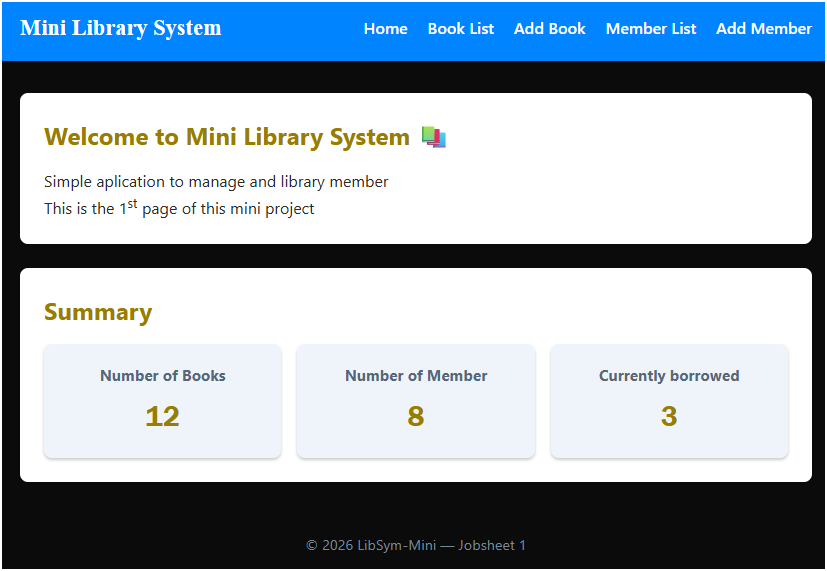

|  | Desain Dan Pemrograman Web |
|--|--|
| NIM |  254107020241|
| Nama |  Hikmal Fadhillah Rasyid Andro Mulyawan |
| Kelas | TI - 2F |
| Repository | [link] (https://github.com/hikmal-byte/DPW-2026-Hikmal-Fadhillah-Rasyid) |

# Labs #1 Programming Fundamentals Review

## 2.1.1. Selection Solution

The solution is implemented in Pemilihan1.java, and below is screenshot of the result.

![Screenshot]
![Screenshot]
![Screenshot]
![Screenshot]
![Screenshot]
![screenshot]
![screenshot]

**Brief explanaton:** There are 4 main step: 
1. Pada layout awal yaitu dekstop, di gambar hasil.png, tampilan tetap sama seperti pada jobsheet 2.
2. Namun pada layar dengan ukuran dibawah 768pixel (kebanyakan layar tablet) tampilan akan sedikit berubah menyesuaikan dengan lebar layar agar card tidak tampil dengan ukuran terlalu kecil di gambar hasil 2.png
3. Penyesuaian paling terlihat pada layar mobile, dimana grid berubah menjadi 1 kolom saja, dan ukuran tabel yang terlalu lebar juga dibuat terpotong namun bisa di scroll. Ditambahkan juga humberger menu agar navbar tidak terlalu berhimpitan pada gambar hasil 7.png
4. Decide the final status

## 2.1.1. Selection Solution
